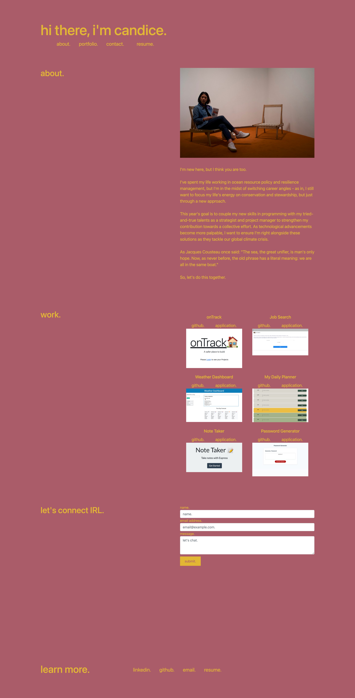

# react-portfolio

## Description
This application is first my updated React-built portfolio. It includes some information about why I've made the decision to learn coding and what I'd like to do with this new skillset after the UCLA coding bootcamp ends. I'd like to keep this application updated as I begin my career search so that prospective employers can get a glimpse into who I am and what type of projects I've contributed to. 

The portfolio also includes my contact information via LinkedIn, Github, and my personal email address.

## Table of Contents
  - [Description](#description)
  - [Installation](#installation)
  - [Usage](#usage)
  - [License](#license)
  - [Contributing](#contributing)
  - [Tests](#tests)
  - [Questions](#questions)

## Installation
For installation and deployment, please [click here](https://candiceywu.github.io/react-portfolio/). The application should launch and all links within it are active. The application is responsive.

## Usage
The application includes navigation links at the top that provide ease of use for redirecting to other sections below (specifically, to the 'about' and 'work' sections). The Horiseon application (large image under 'work') will open to a new tab with a previous homework assignment. Applications 2-5 do not work yet, but I'll be updating these with clickable links as the bootcamp progresses and I have more to add to my portfolio. The following image shows the web application's appearance:

## License
This application is licensed under MIT.

## Contributing
NA.

## Tests
NA.

## Questions
For any questions, please reach out via:
  
GitHub: candiceywu; and

Email: candice.ying.wu@gmail.com.